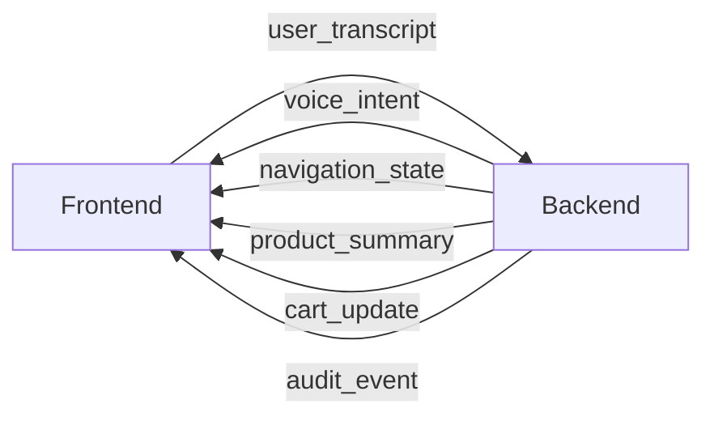

# API Contracts

This document defines the realtime websocket contract between Luminar frontend and backend.

## Websocket Endpoint

- URL: `ws://localhost:8100/session`
- Transport: JSON messages over websocket
- Session key: `sessionId`

## Message Direction



## Frontend -> Backend

### `user_transcript`

```json
{
  "type": "user_transcript",
  "sessionId": "luminar-3bdb2f4e-1111-2222-3333-123456789abc",
  "transcript": "Find wireless headphones under 5000 rupees",
  "timestamp": "2026-03-08T09:35:20.000Z"
}
```

Fields:

- `type`: fixed string (`user_transcript`)
- `sessionId`: current frontend session id
- `transcript`: recognized speech text
- `timestamp`: ISO-8601 timestamp

## Backend -> Frontend Envelope

All backend events may include the shared envelope:

```json
{
  "type": "navigation_state",
  "sessionId": "luminar-3bdb2f4e-1111-2222-3333-123456789abc",
  "description": "Navigated to search results page",
  "metadata": {
    "merchant": "amazon.in",
    "latencyMs": 842
  }
}
```

Common fields:

- `type`: event type
- `sessionId`: backend session id
- `description`: human-readable summary
- `metadata`: event-specific key/value payload

## Event Types

### `voice_intent`

Intent extracted/acknowledged by backend.

```json
{
  "type": "voice_intent",
  "sessionId": "luminar-...",
  "transcript": "Find running shoes under 3000",
  "description": "Intent parsed for budget running shoes",
  "metadata": {
    "category": "running shoes",
    "budget": 3000
  }
}
```

### `navigation_state`

Navigation execution updates from automation runtime.

```json
{
  "type": "navigation_state",
  "sessionId": "luminar-...",
  "navigationState": {
    "status": "In Progress",
    "step": "Opening product details page",
    "url": "https://www.amazon.in/..."
  },
  "metadata": {
    "stepIndex": 3
  }
}
```

### `product_summary`

Product findings/ranking summary.

```json
{
  "type": "product_summary",
  "sessionId": "luminar-...",
  "productSummary": "Top match: Brand X running shoes at 2799.",
  "agentResponse": "I found a strong option at 2799 rupees.",
  "metadata": {
    "resultCount": 24
  }
}
```

### `cart_update`

Cart state mutations.

```json
{
  "type": "cart_update",
  "sessionId": "luminar-...",
  "cart": {
    "itemCount": 1,
    "subtotal": "2799",
    "currency": "INR"
  },
  "metadata": {
    "action": "add_to_cart"
  }
}
```

### `audit_event`

Audit/debug or verification signals.

```json
{
  "type": "audit_event",
  "sessionId": "luminar-...",
  "audit": {
    "level": "warning",
    "message": "Price changed between listing and product page",
    "details": {
      "listingPrice": 2799,
      "detailPrice": 2899
    }
  },
  "metadata": {
    "requiresUserConfirmation": true
  }
}
```

## Frontend Session Timeline Mapping

Each received event is normalized to:

```ts
type SessionEvent = {
  id: string;
  timestamp: string;
  type: "voice_intent" | "navigation_state" | "product_summary" | "cart_update" | "audit_event";
  description: string;
  metadata: Record<string, unknown>;
};
```

The timeline UI supports:

- expandable metadata view
- type color coding
- export as JSON (`Export Session Log`)
