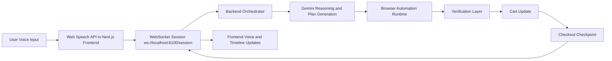
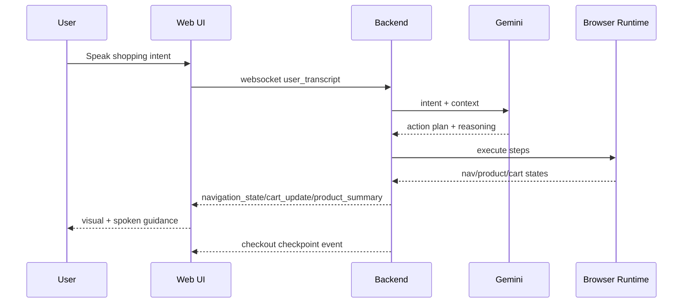

# BlindNav Architecture

BlindNav (`Luminar`) is a voice-first shopping copilot with a realtime loop between frontend voice capture, backend reasoning, and browser automation.

## End-to-end Flow

## Core Components

- `apps/web` (Next.js + React + TypeScript + Tailwind)
- `apps/api` (FastAPI websocket and orchestration endpoints)
- `browser-runtime` (Playwright-based execution engine)
- `data` and `packages` (shared schemas/contracts and fixtures)

## Runtime Responsibilities

1. Voice Input
- Frontend captures speech with Web Speech API.
- Transcript is sent to backend over websocket session.

2. Gemini Reasoning
- Backend interprets intent and builds navigation/action steps.
- Reasoning output is emitted as typed realtime events.

3. Browser Automation
- Playwright runtime executes action plan against merchant pages.
- Intermediate navigation and extraction states are streamed back.

4. Verification
- Extracted product/cart data is validated against request intent.
- Verification failures emit audit events and recovery suggestions.

5. Cart and Checkout Checkpoint
- Backend confirms intended item(s) and cart totals.
- System stops at explicit checkout checkpoint for human approval.

## Sequence Diagram

## Notes

- Websocket is the primary realtime channel.
- Frontend timeline acts as session audit trail.
- Checkout is intentionally a gated checkpoint, not silent auto-purchase.
